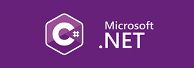

## ☀️ Sergey Svistunov
> C# developer 

👔   I've worked in IT presales for many years. I started as a sysadmin and VBA developer, worked as a project manager, business analyst, and continued in presales. I've been researching, building and selling complex solutions all my life.
Then I decided to switch to programming and now I work as a C# developer.
 
***
### I have significant experience in three areas:
* Printing and document processing (worked at Xerox and Kyocera),
* IoT projects for cars (Brightbox, C-Cars),
* Banking and payment systems (Ingenico, Blockchain startup).

💻 After years of working in so many very different companies and environments, around 2020 I decided to expand my skills in a more technical direction. I started with CodeWars achieving 3kyu level in C++ and Kotlin, then I applied that knowledge to real-world projects, some of which you can find here on GitHub. 
     
***
> The world of programming isn't uncharted territory for me,  but it's still hard to learn to code well. 

### Over the years, my language path has looked like this:

#### QuickBasic ➔ 8086_assembly ➔ VBA ➔ VB6 ➔ VB.NET ➔ a looong break ➔ JavaScript ➔ C++ ➔ Kotlin ➔ Java ➔ C# 

 

I ended up getting a **C#** job, which means that from now on I am going to prioritize the .NET platform. Other languages and platforms have to wait.  

### Languages I like:

 &nbsp;&nbsp;&nbsp;&nbsp;&nbsp;&nbsp;&nbsp;&nbsp;&nbsp;
 &nbsp;&nbsp;

***

🏃 Beside programming languages, I'm fluent in English, German and Russian. 
 

✨ Please feel free to let me know if anything:  

   
 Updated 16-Apr-2023 

