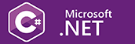

## ☀️ Sergey Svistunov
> C# developer 

👔   I've worked in IT presales for many years. I started as a sysadmin and VBA developer, worked as a project manager, business analyst, and continued in presales. I've been researching, building and selling complex solutions all my life.
Then I decided to switch to programming and now I work as a C# developer.
 
***
### I have significant experience in three areas:
* Printing and document processing (worked at Xerox and Kyocera),
* IoT projects for cars (Brightbox, C-Cars),
* Banking and payment systems (Ingenico, Blockchain startup).

💻 After years of working in so many very different companies and environments, around 2020 I decided to expand my skills in a more technical direction. I started with CodeWars achieving 3kyu level in C++ and Kotlin, then I applied that knowledge to real-world projects, some of which you can find here on GitHub. 
     
***
> The world of programming isn't uncharted territory for me,  but it's still hard to learn to code well. 

### Over the years, my language path has looked like this:

#### :arrow_forward: QuickBasic ➔ 8086_assembly ➔ VBA ➔ VB6 ➔ VB.NET ➔ a looong break ➔ JavaScript ➔ C++ ➔ Kotlin ➔ Java ➔ C# 

 

I ended up getting a **C#** job, which means that I prioritize the .NET platform überall. Other languages and platforms will wait.  

### Languages I like: &nbsp;&nbsp;  &nbsp;&nbsp;  

***

🏃 Beside programming languages, I'm fluent in English, German and Russian. 
I used to do a lot of long-distance running, but now I mostly walk because of time constraints.

✨ Please feel free to let me know if anything:  

  

***

### Technologies, applications and frameworks I consider, learn, or already work with:
*	MS Visual Studio 
*	NuGet packages
*	Markdown language
*	VBA programming for Excel, Word, Access
*	MS Office docs (EPPlus, Spire.Doc)
*	Data Structures and Algorithms
*	ELMA BPM
*	.NET Core
*	LINQ
*	UI frameworks (Windows Forms, WPF, MVVM, MVVMCROSS)
*	Git, GitHub
*	ASP.NET, MVC, Razor pages, HTML, CSS
*	Blazor WEB-Framework
*	Unit testing (xUnit, NUnit, MSTest)
*	Arch. principles (SOLID, TDD, DI, IoC)
*	ADC input modules (OVEN MB110-220.8AC, OVEN MB110-224.8A)
*	DryIoc IoC Container
*	Serializing (Newtonsoft.Json, System.Text.Json)
*	ORM (NHibernate, Entity Framework - EF Core, Dapper)
*	ADO.NET
*	API (REST, SOAP, XML-RPC, JSON-RPC)
*	Layered pattern, DDD, CQRS&EventSourcing
*	CI/CD
*	DB (PostgreSQL, MS SQL Server, MongoDB, LiteDB, Transact-SQL)
*	Containerization (Docker, Kubernetes - k8s)
*	Azure Cloud Services
*	In-memory data sotre (Redis, Memcached)
*	Linux
*	Authentication protocols (OAuth 2.0, OpenID Connect)
*	Universal Windows Platform (UWP)
*	Atlassian Jira, Confluence
*	Comm protocols (Modbus, TCP/IP, TCP/UDP, VoIP)
*	Messaging (RabbitMQ)
*	gRPC
*	JS, JavaScript, TypeScript
*	Frontend frameworks (React, VueJs, Angular, Aurelia, Svelte, MobX, NextJS)
*	Agile frameworks (Scrum, Kanban, Extreme Programming)
*	Service Orientated Architecture (SOA)

    
 Updated 27-Apr-2023 

